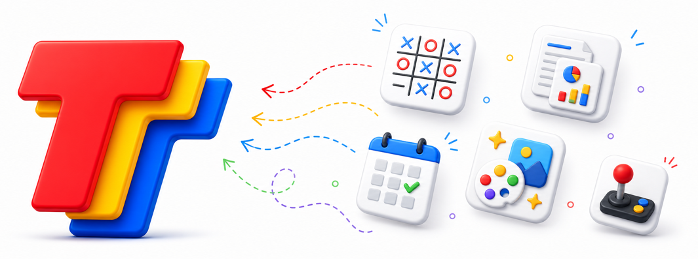

# TapTalk Tools

This repository contains small, runnable MCP server examples for TapTalk tools.

An MCP server can expose one or more tools. Some tools are voice-only; others can link to an MCP Apps UI resource so TapTalk can render a focused interface for the user. These examples show both sides: server-owned tools and state, plus optional UI that talks to the host with the standard MCP Apps client API.

Each example is self-contained under `apps/` so developers can read, run, and deploy one tool server at a time.

## Examples

- [TicTacToe](./apps/tictactoe/) - a stateful MCP game server with TapTalk-callable tools, a React MCP Apps UI, and database persistence.

More MCP examples coming soon.

## Docs

TapTalk tool docs live in the TapTalk developer docs. This repository focuses on runnable examples that pair with those docs while staying compatible with the standard MCP Apps protocol.
